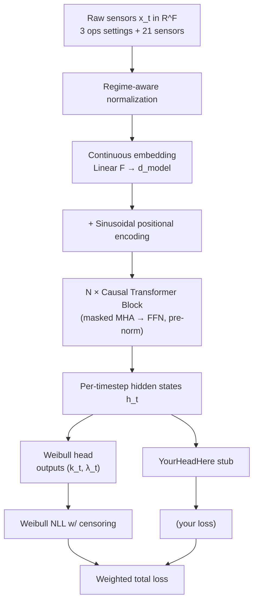

# Multivariate Time-to-Event Transformer

A from-scratch PyTorch tutorial that builds a **causal transformer with a
Weibull time-to-event head**, applied to NASA's CMAPSS jet engine
degradation dataset.

The entire project lives inside a single Jupyter notebook
(`notebook.ipynb`) that walks from raw sensor data to a working
probabilistic forecaster — every architectural component built by hand,
every concept explained with intuition first and rigorous math on demand.

## Table of Contents

- [What you'll learn](#what-youll-learn)
- [What you'll build](#what-youll-build)
- [Prerequisites](#prerequisites)
- [Installation](#installation)
- [Data](#data)
- [Usage](#usage)
- [Architecture overview](#architecture-overview)
- [Roadmap](#roadmap)
- [License](#license)

## What you'll learn

- How a **causal transformer** processes multivariate time series and why
  causal masking gives a clean streaming-inference story
- How to build the transformer's components from scratch:
  continuous-input embedding, sinusoidal positional encoding,
  scaled dot-product attention with masks, multi-head attention,
  pre-norm transformer blocks
- How a **Weibull head** parameterizes a full distribution over time-to-event
- How the **negative log-likelihood with right-censoring** lets you train on
  data where some observations end before the event of interest
- How to convert a predicted distribution into a **point estimate with
  calibrated error bars** ("87 cycles, 90% CI: 62–121")
- How to evaluate a survival model — concordance index, Brier score,
  calibration plots
- How to handle real-world data quirks: variable-length sequences,
  multiple operating regimes, sensor selection

## What you'll build

By the end you'll have a model that takes a stream of multivariate sensor
readings and outputs, at every timestep, a probability distribution over
the remaining time before the system fails — with proper uncertainty.

The architecture is set up to support **multiple output heads** (e.g.,
adding a regime classifier or sensor-reconstruction head) without
rebuilding the encoder.

## Prerequisites

- Comfort with PyTorch fundamentals (tensors, `nn.Module`, training loops)
- Basic familiarity with attention / transformers helps but is not required
- Some exposure to probability distributions (PDF, CDF) is helpful;
  the notebook includes refreshers

## Installation

```bash
git clone <this repo>
cd multivariate-transformer-time-to-event

python -m venv .venv
source .venv/bin/activate          # Windows: .venv\Scripts\activate

pip install -r requirements.txt
python -m ipykernel install --user --name=tte-transformer
```

## Data

The notebook auto-downloads the CMAPSS dataset from Kaggle on first run.
You'll need a Kaggle API token configured at `~/.kaggle/kaggle.json` (see
[Kaggle API docs](https://www.kaggle.com/docs/api)).

If the Kaggle download fails, see `data/README.md` for manual download
instructions from NASA's open data portal.

## Usage

```bash
jupyter lab notebook.ipynb
```

The notebook is meant to be worked through top-to-bottom. Each code cell
contains a signature, docstring, and TODO hints — **you write the
implementation**. The markdown cells explain the why.

## Architecture overview



The full diagram and architecture rationale live in Part 0 of the notebook.

## Roadmap

See `REQUIREMENTS.md` for the full milestone list. At a glance:

- **M1** — Data pipeline (load, normalize, build training tensors)
- **M2** — Model components from scratch (embedding → attention → blocks)
- **M3** — Training loop with Weibull NLL
- **M4** — Evaluation + distribution-to-number conversion
- **M5** — Extensions (more heads, more datasets, attention visualization)

## License

MIT — see `LICENSE`.
